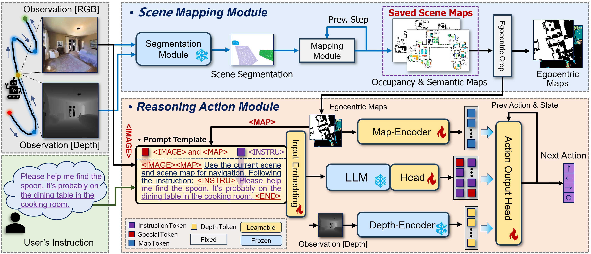

# ReasonWalker: Reasoning Iterative Vision-and-Language Navigation with Implicit Instructions

This is the official implementation of ReasonWalker, a new navigation model for exploring reasoning navigation with user implicit instructions in a persistent environment over time. To ensure persistent and efficient operation, ReasonWalker builds and saves explicit scene maps to learn scene associations for efficient re-navigation in subsequent episodes. To enable comprehension analysis of implicit instructions, ReasonWalker leverages a large language model to jointly reason user instructions with agent observed states and scene maps to generate semantic instruction navigation tokens. ReasonWalker combines the extracted tokens with the agent's current states to predict the next action achieving navigation. For ReasonWalker training, we propose a two-stage learning paradigm to sequentially learn navigation actions, and associations with navigation scene objects. We also provide a new implicit instruction benchmark for training and evaluating the reasoning navigation task. Extensive experiments demonstrate the effectiveness and superiority of ReasonWalker.
<p align="center">
  
</p>

## Setup

1. Dependencies

* Python 3.8
* habitat-sim=0.1.7 headless
* habitat-lab=0.1.7

```bash
conda create --name vln python=3.8
conda activate vln
```

2. Requirements

```bash
pip install -r requirements.txt
```

3. Datasets

The code expects files in this structure (examples of the Implicit IR2R-CE dataset):

```graphql
data/datasets
├─ R2R_VLNCE
|   ├─ train
|   |    ├─ train_guide.json.gz
|   |    ├─ train_guide_gt.json.gz
|   |    ├─ train_follower.json.gz
|   |    ├─ train_follower_gt.json.gz
|   ├─ val_seen
|   |    ├─ val_seen_guide.json.gz
|   |    ├─ val_seen_guide_gt.json.gz
|   |    ├─ val_seen_follower.json.gz
|   |    ├─ val_seen_follower_gt.json.gz
|   ├─ val_unseen
|   |    ├─ val_unseen_guide.json.gz
|   |    ├─ val_unseen_guide_gt.json.gz
|   |    ├─ val_unseen_follower.json.gz
|   |    ├─ val_unseen_follower_gt.json.gz
|   ├─ test_challenge
|   |    ├─ test_challenge_guide.json.gz
|   ├─ text_features
|   |    ├─ ...
```
The `data/scene_datasets/mp3d` should place all the 3D scene datas of [MP3D](https://niessner.github.io/Matterport/). The [Implicit IR2R-CE dataset](https://pan.baidu.com/s/1kC2jY3JOD2bc5Dd4S_-XvQ?pwd=5bvu)

4. Multimodal Large Language Model

Please dowload [Qwen2-7b](https://huggingface.co/Qwen/Qwen2-7B) from `huggingface` and place it under the `model`.

## Run Code

### Training Agents
```bash
python run.py \
  --run-type train \
  --exp-config /ivlnce_baselines/config/map_cma/pred_semantics/iterative_maps/0_train_tf.yaml
```

Then, swap `train` for `eval` to evaluate each checkpoint. Take the best performing checkpoint and fine-tune with DAgger:

```bash
python run.py \
  --run-type train \
  --exp-config ivlnce_baselines/config/map_cma/pred_semantics/iterative_maps/1_ftune_dagger.yaml \
  IL.ckpt_to_load /data/checkpoints/map_cma/pred_semantics/iterative_maps/0_tf/ckpt.0.pth
```

### Evaluating Agents
```bash
CUDA_VISIBLE_DEVICES= 0, 1; python run.py \
  --run-type eval \
  --exp-config ivlnce_baselines/config/map_cma/pred_semantics/iterative_maps/2_eval_iterative.yaml
  IL.ckpt_to_load /data/checkpoints/map_cma/pred_semantics/iterative_maps/0_tf/ckpt.0.pth
```

### Acknowledgements

This project is based on the [VLN-CE](https://github.com/jacobkrantz/VLN-CE) and [IVLN-CE](https://github.com/jacobkrantz/IVLN-CE), our LLM is based on [Qwen2-7b](https://huggingface.co/Qwen/Qwen2-7B). We are grateful for all these good works!
If you find our work inspiring or use our codebase in your research, please consider giving a star ⭐ and a citation.
